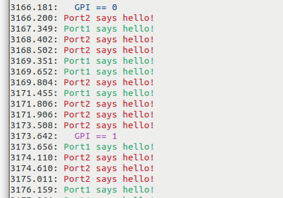
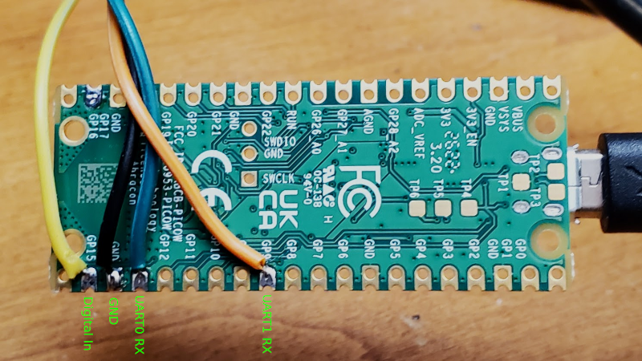

# RX Dual UART

Have you ever wanted to monitor both the send and received
data of a UART simultaneously without having to use multiple
terminals?

Well, this project is for you!

This uses both UARTs of the Rasperry Pi Pico to show serial data
from two sources, each one with a different color for easy
differentiation.

It also shows when the digital input transitions.

## Sample Output



## Wiring



## Programming

1. [Load MicroPython](https://www.raspberrypi.com/documentation/microcontrollers/micropython.html) on the RP2040 Pico by copying the .uf2 file to the Pico via USB.
2. Copy the MicroPython code in the `code_upy` folder to the Pico. The easiest way is to use the [Thonny editor](https://thonny.org/).
3. Run the code or detach/attach and use a serial terminal to the Pico.

You can use `dmesg` to find which port. Example below shows `/dev/ttyACM0` is the assigned serial port for the Pico.

```
[ 7780.542519] usb 1-6.4.4: new full-speed USB device number 12 using xhci_hcd
[ 7780.644907] usb 1-6.4.4: New USB device found, idVendor=2e8a, idProduct=0005, bcdDevice= 1.00
[ 7780.644919] usb 1-6.4.4: New USB device strings: Mfr=1, Product=2, SerialNumber=3
[ 7780.644924] usb 1-6.4.4: Product: Board in FS mode
[ 7780.644929] usb 1-6.4.4: Manufacturer: MicroPython
[ 7780.644932] usb 1-6.4.4: SerialNumber: e66141040363bd2e
[ 7780.655115] cdc_acm 1-6.4.4:1.0: ttyACM0: USB ACM device
```
